# 函数-function
## 函数的定义域

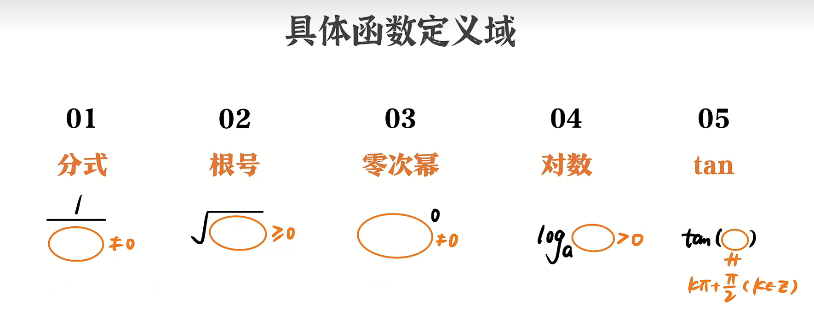

## 抽象函数的定义域

* **函数定义域永远取决于x的范围**
* **同一个f，括号内整体的范围始终相同** 
## 求解析式的四类方法
### 待定系数法
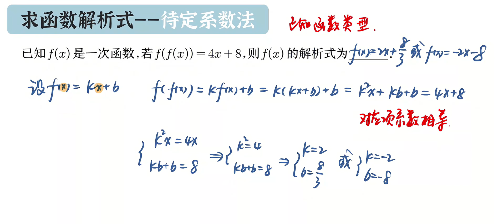  
### 换元法、整体替代法
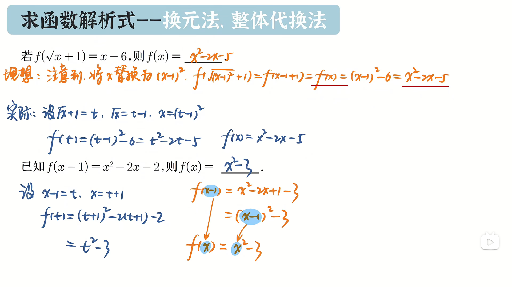  
### 构造方程组
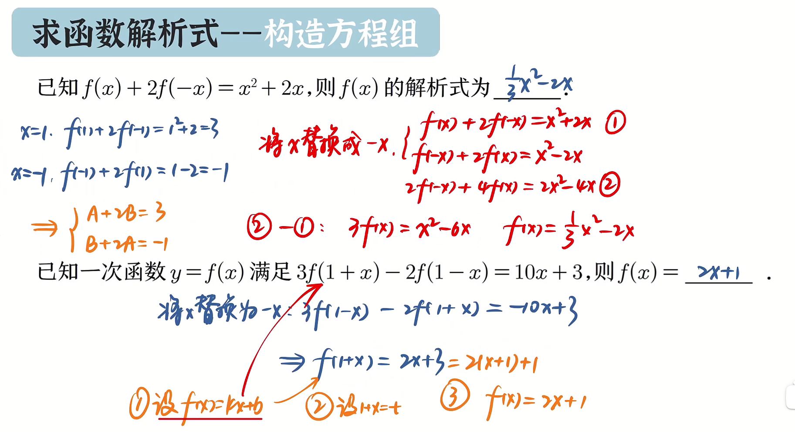

### 一次函数
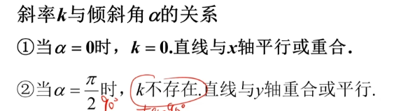
### 二次函数
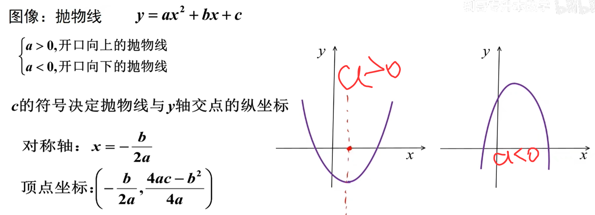

## 基本初等函数
### 幂函数
y=x^a (a可以为任意值)
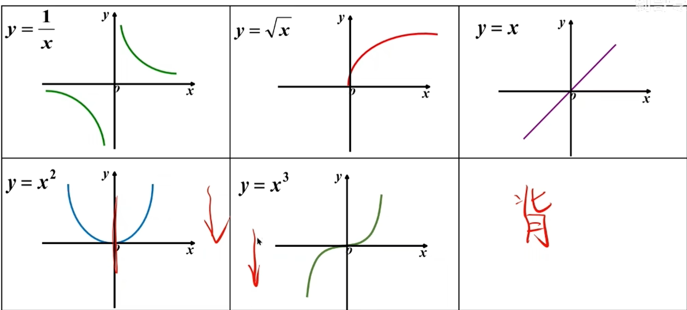
### 指数函数
y=a^x (a≠0，a>0)
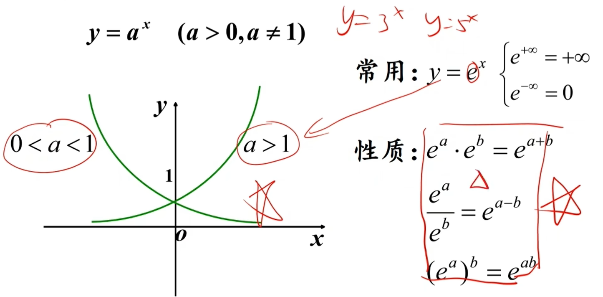
### 对数函数
y=log e X =lnX
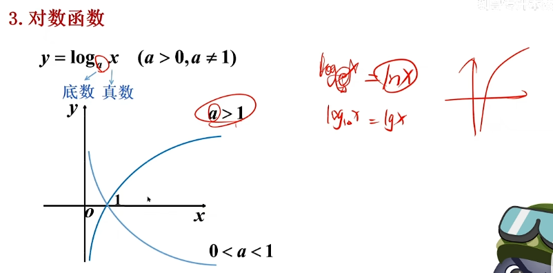
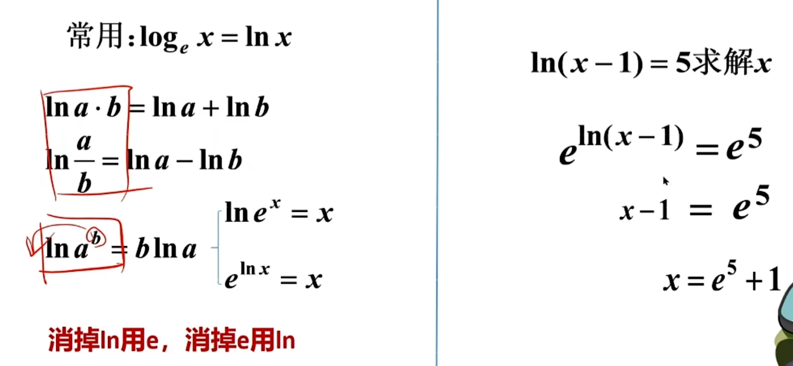

### 三角函数

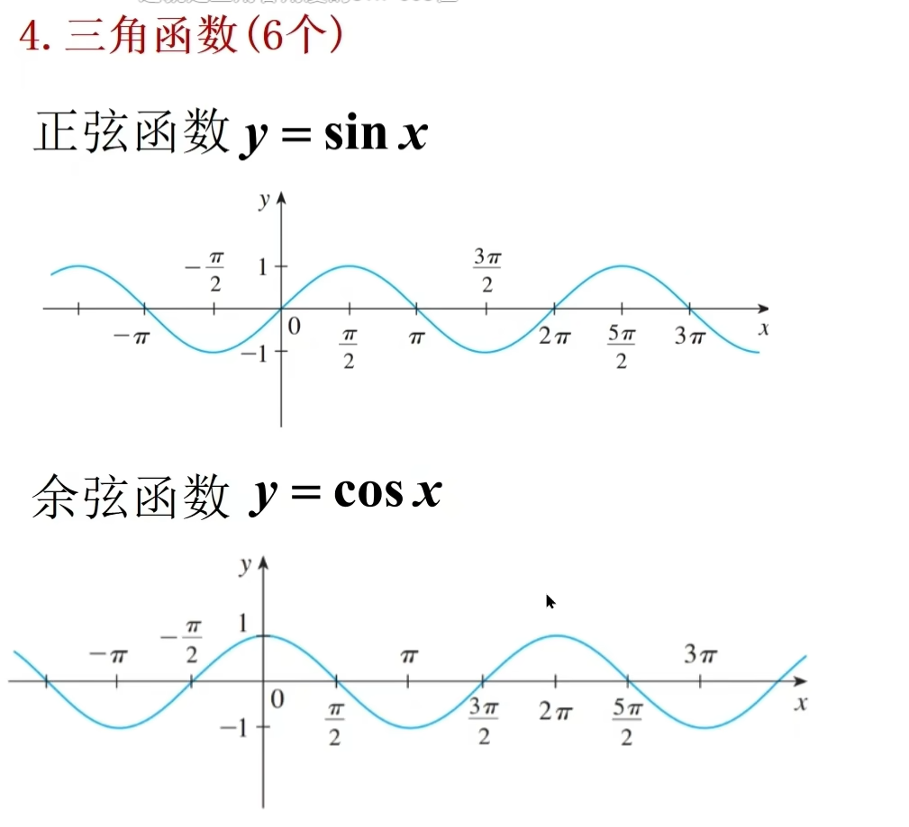
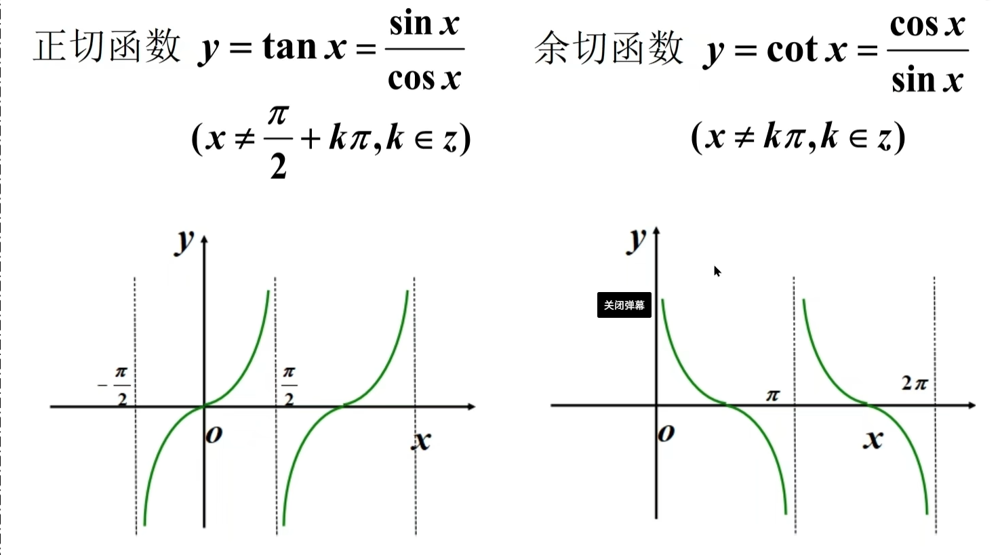
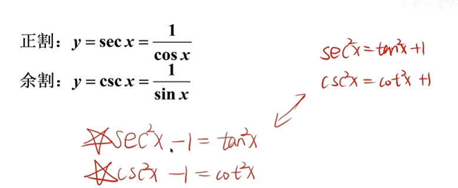
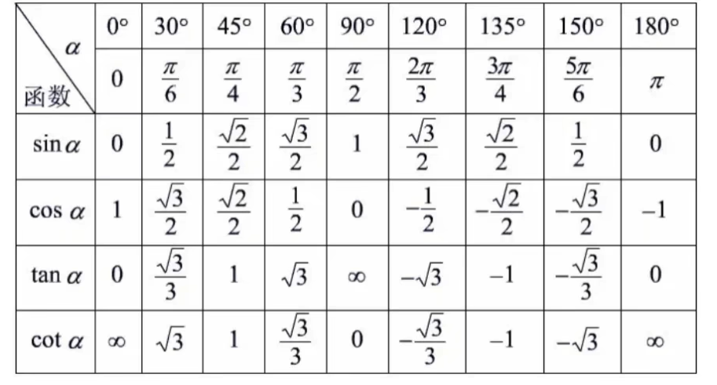
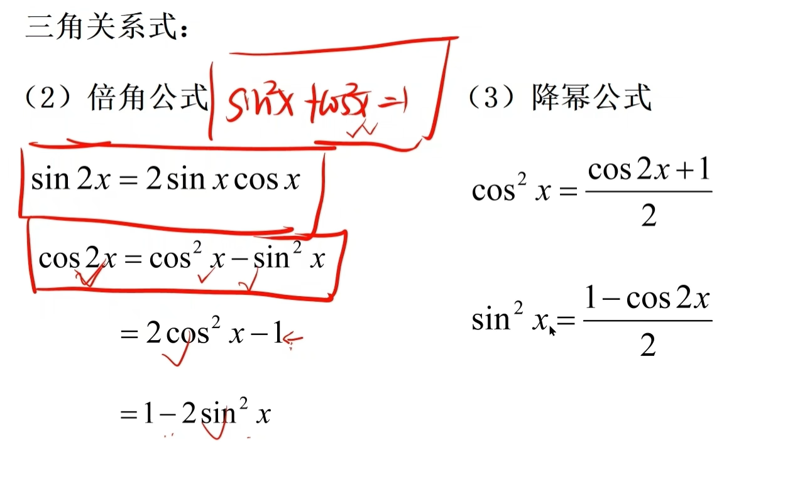
### 反三角函数
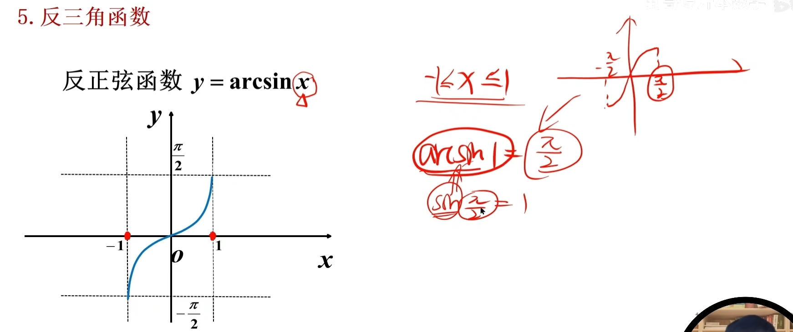
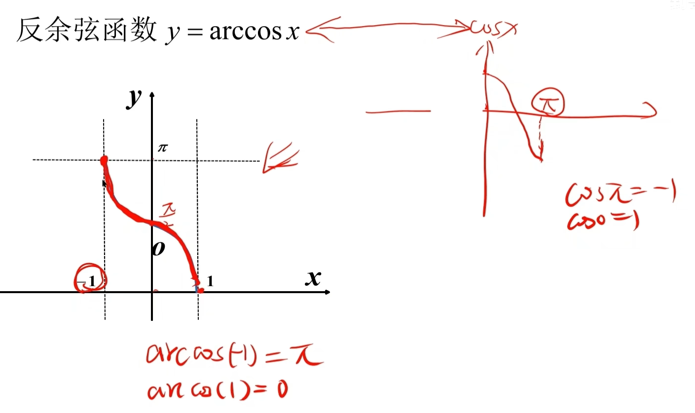
* **反正切函数 y=arctanx(-Π/2<y<Π/2>)**
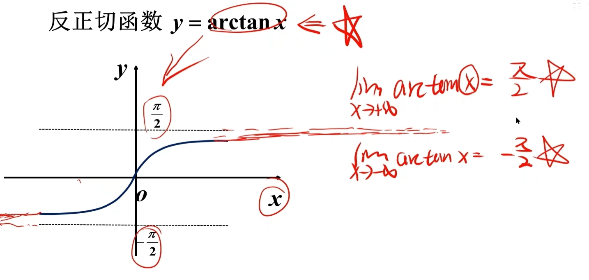
* 反余切函数
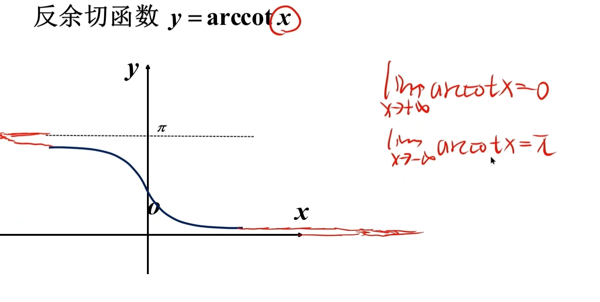
...